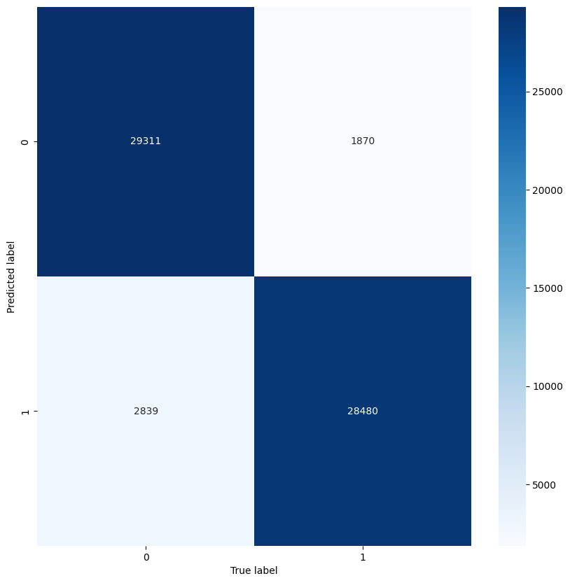
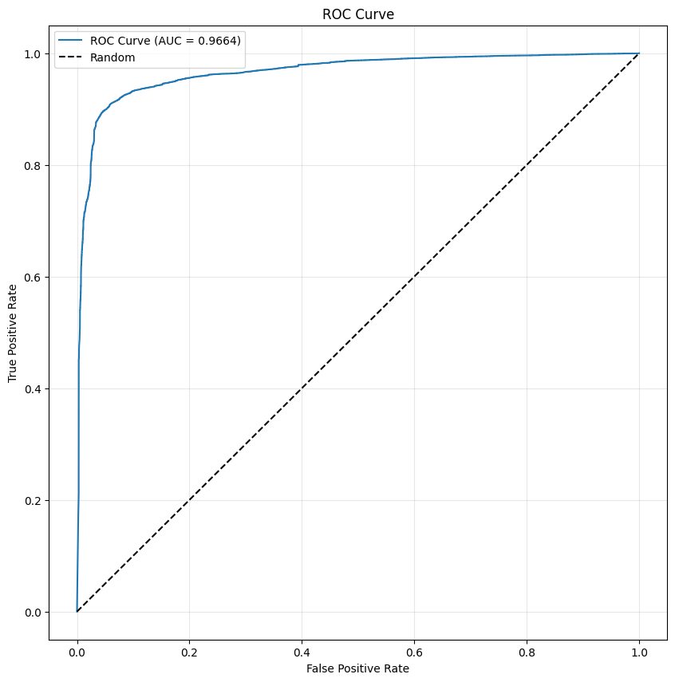
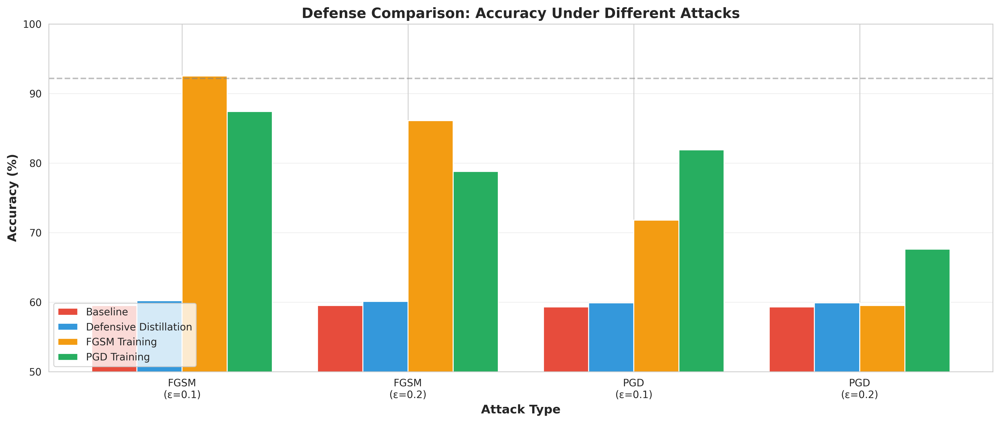
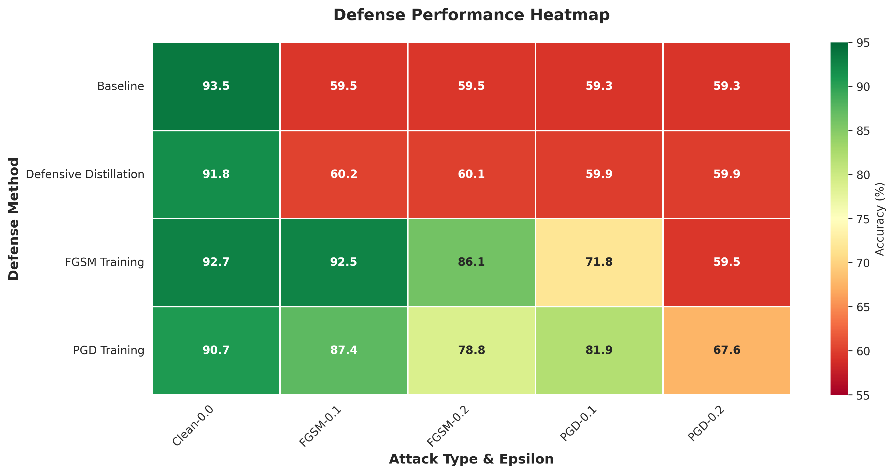

# Adversarial-Security-Project

# Overview
Malware is one of the most commonly recognized forms of attacks that antivirus programs detect for. The features of these files that are used for detection could possibly be modified by attacks without changing aspects of the payload, allowing for them to slip past detection. Adversarial attacks are attacks which rely on (relatively) small changes to a file in order to cause mis-classification by a detection system, and could be leveraged by attackers to subvert antivirus/malware detection systems. Some defenses against these adversarial attacks are known and documented in the literature, and are employed in this project to compare their relative efficacy for this task. For this project I used the [Elastic Malware Benchmark for Empowering Researchers (EMBER)](https://www.kaggle.com/datasets/dhoogla/ember-2018-v2-features) dataset. The dataset contains several thousand features from ~1 million PE files, and is sufficiently rich to train detection models and test them.

## Methods

Due to memory constraints, I had to subsample down to 250,000 files rather than the full 1 million, however basic checks of the baseline model indicates that this level of data is more than sufficient to train a classifier to similar levels of train/test accuracy as reported in the original ember model.

The baseline detection model used was as simple feedforward betwork with ReLU nonlinearities in the hidden layers that uses a sigmoid in the final layer to report probabilities of the file belonging to malware or not. Basic metrics assessed were: accuracy, precision, recall, f1-score, and ROC-AUC.

After the baseline model was trained we generated adversarial examples using FGSM and PGD and checked baseline model accuracy against these attacks. The range of defenses used to train models were distillation and adversarial training (on FGSM or PGD). Adversarially trained models simply used the adversarial examples for their respective attack as training data. The distillation defense used the baseline model as the "teacher" model rather than training a new one for simplicity.

## Results

  
  

The baseline model trained on roughly ~1/4 of the total data exhibits very strong performance on test, indicating that smaller sample size should not drastically reduce the validity of our results.

### Model Behavior Analysis

  
  

From the above we can see the baseline test accuracy (dashed) is typically much higher than any of our trained models can reach when subjected to adversarial examples. The distillation defense is quite weak against gradient based attacks and seems no better than untrained networks, which is in agreement with some reports ([Carlini and Wagner,2016](https://arxiv.org/abs/1607.04311)). Additionally, despite its exceptional performance against FGSM attacks, models trained on FGSM attacks are quite brittle when subjected to other attacks (PGD), and the results here likely reflect some degree of gradient masking. In contrast, the PGD-trained models seem to remain relatively robust (accuracy>75%) across all but the most challenging scenario tested (PGD attacks with epsilon budget of 0.2).

## Concluding Remarks

From this cursory analysis we see that adversarial models need to be trained under very strong attacks in order to be effective especially in general use settings as malware detectors. That PGD-trained models performed most robustly is perhaps unsurprising as the attack is considered state of the art for a reason. A particular point that cannot be addressed from this examination is the feasability of these attacks in practice.

Since these attacks require modification of the file features in order to move to different parts of the gradient, it would be extremely useful to identify the features most useful for crossing a classification boundary. One can imagine a case where the examples for which our trained models fail require modifications to file features that are infeasible for attackers or would render the malicious file ineffective, meaning that our classifiers could be, in truth, much more powerful than indicated. Additionally, if we were able to identify such features, then the general attack strategy used here could simply be a first line defense, as more specialized models focusing on modifications along key axes/features would offer higher specificity against the most feasible modifications that attackers could employ. Unfortunately, due to the structure of the EMBER dataset, the features are generically labeled and not interpretable, so this is  not possible with the current dataset, but remains a potential avenue for future development.

### How to run
You can just clone the repo and add the EMBER dataset path to the line 7 in dataLoad.py.

The project was built to work as command line tools, so start with python src/model/trainModel.py and then you can proceed with any of the other files.

### Technologies Used
- **Python 3.8** - Primary language
- **Pandas & NumPy** - Data processing
- **Adversarial Robustness Toolbox** - PGD and FGSM
- **pyTorch** - Models
- **Matplotlib/Seaborn** - Visualization
